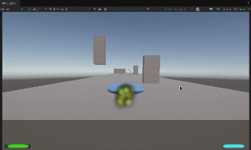

# tse

This Unity project, title TBD, is an on-rails shooter akin to `StarFox` and `Panzer Dragoon`.

I plan to use `claude.code` to assist in my development efforts - both to accelerate development and to sharpen my prompting skills!

Please feel free to raise a GitHub issue with ideas or thoughts on the prototype! Especially as it pertains to game optimization.

Project currently uses Unity version `6000.3.2f1`

## Level Designer

Custom tooling for building levels in the Unity Scene view.

### Setup

1. Create assets via **Create > Level Designer > Path Data** and **Level Settings**
2. Add an empty GameObject (e.g. "LevelSystem") with these components:
   - `LevelPathFollower` - assign your Path Data asset
   - `LevelManager` - assign your Level Settings asset
   - `LevelEnemySpawner`
3. On **PlayerShip**, set `PlayerShipMovement.Path Follower` to the LevelSystem object
4. On **Main Camera**, set `CameraFollowController.Path Follower` to the LevelSystem object

### Editing Paths

- Select the LevelSystem object, then activate the **Path Editor Tool** from the component tools toolbar
- **Shift+Click** to add waypoints, **Delete** to remove selected
- Drag handles to reposition; adjust per-segment speed in the tool panel

### Placing Enemies

- Select the LevelSystem object, activate the **Enemy Placement Tool**
- Pick enemy type from the dropdown, **Ctrl+Click** near the path to place
- Drag handles to adjust offset from path, **Delete** to remove selected

### Environment

Set `Environment Type` on the Level Settings asset:

- **Space** - skybox only
- **Ground** - Unity Terrain spawned below path
- **Hybrid** - both

## Contributing

Please create a branch using the below pattern:

- `feature/name-of-feature`
- `bugfix/bug-fix`
- `chore/thing-to-do`

Create a PR into `main` and review. Add references to any GitHub issues in [`tse` Project Board](https://github.com/users/concordion2k/projects/1/views/2) in the PR title and body.

